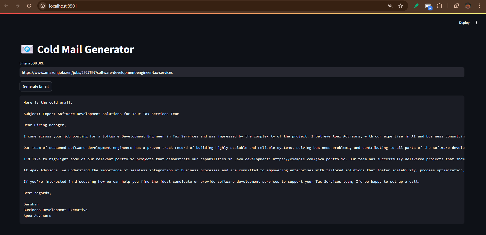

# Cold Email Generator  

### UI


## 📌 Overview  
This Python-based **Cold Email Generator** automates the process of crafting personalized cold emails for job applications. Given a link to a company's careers page, the script:  
1. Extracts job details from the website.  
2. Uses an **LLM model** to identify the required skills from the job description.  
3. Matches those skills with relevant projects listed in a **CSV file** (`portfolio.csv`).  
4. Generates a **customized email** that highlights matching projects with their links.  

## 🚀 Features  
✅ Web scraping to extract job data  
✅ LLM-based skill extraction
✅ Automated project matching  
✅ Personalized cold email generation  

## 📂 Project Structure  
│── chains.py # Handles LLM interactions   
│── main.py # Main script to run the generator   
│── portfolio.py # Project portfolio handling   
│── requirements.txt # Required dependencies   
│── utils.py # Utility functions   
│── resources  
│ └── portfolio.csv # CSV file containing project details


## 🛠 Installation  
1. **Clone the repository**     
   ```bash   
   git clone https://github.com/yourusername/cold-email-generator.git
   cd cold-email-generator
2. **Install Dependencies**      
   pip install -r requirements.txt

## Usage
  Run this command in main.py     
  streamlit run .\app\main.py
